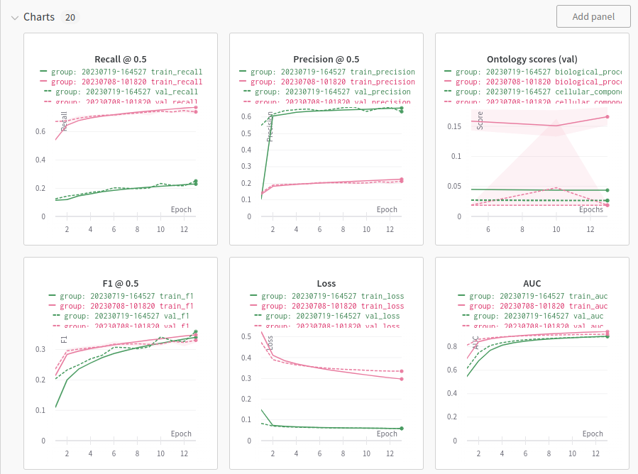

# CAFA 5 Protein Function Prediction

Predict the biological function of a protein. 

Team rähmä ai solution codebase to the [CAFA5 Kaggle competition](https://www.kaggle.com/competitions/cafa-5-protein-function-prediction/overview).

We reached [41st place](https://www.kaggle.com/competitions/cafa-5-protein-function-prediction/leaderboard) (top 3%) by ensembling our MLP models trained on ESM and T5 protein embeddings with a DIAMOND sequence alignment-based method.

What worked:
- Training on protein features generated with pretrained large transformer protein language models (ESM2 & T5).
- GroupKFold cross-validation strategy where groups were generated by protein sequence similarity clustering.
- Predicting only for a subset of 1500 most common labels from the 4K target labels.
- MLP models with residual connections.
- Ensembling MLP models with the DIAMOND method, which fetches protein sequence alignment partial matches from protein databases and predicts the same GO terms with alignment-score weights.

## Python environment & data setup

Check [INSTALL.md](./INSTALL.md).

## Train MLP with protein embeddings

This creates five CV-fold models. The folds are split with protein sequence similarity clustering so that similar proteins end up in same cross-validation folds. 

To train with a config in `src/configs/embedding_v1.py`, run:

```bash
python src/train.py -c embedding_v1
```

*Flags*
- `-c`  or  `--config`,     default="embedding_v1" -    config name without .py extension
- `-d`  or  `--device`,     default="cuda" -    cuda or cpu
- `-e`  or  `--eval_every`,     default=1 - how often to evaluate between epochs
- `-m`  or   `--metric_every`,  default=100 -    how often to evaluate competition metric between epochs SLOW!

Sample **embedding_v1 config.py** contents:
```
CFG = {
    'epochs' : 50,
    'n_labels' : 1500,                      # how many labels to use in frequency order
    'emb_type' : 't5',                      # embeddings to use - 't5', 'esm2_3b', 'protbert', 'all'
    'emb_dict' : {                          # used only whe emb_type='all'
        'emb_t5_p': 0.8,                    # what percentage of top ranked features to use
        'emb_esm2_p': 0.3, 
        'emb_protbert_p': 0
    },
    'batch_size' : 2048,
    'train_folds' : [0, 1, 2, 3, 4],        # what folds out of 0-4 to train 
    'input_shape' : 1024,                   # T5 embedding shape
    'lr' : 0.001,
    'optimizer' : 'adam',                   # adam and adamw implemented
    'schedule' : 'cosine',                  # 'cosine' (CosineAnnealing) or 'none' 
    'model_fn' : 'embeddingmodel_v1',       # model file name without .py in models dir
    'model_kwargs' : {                      # kwargs passed for model init
        'n_hidden' : 1024,
        'dropout1_p': 0.2, 
        'use_norm': True,
        'use_residual': True
    }
}
```

Running `train.py` creates timestamped run output folder under `./output/` with `fold-n` subfolders. Models, test predictions, and out-of-fold predictions are saved under each fold dir and metrics & losses are logged to Weights and Biases. The fold ensemble submission is saved under output folder. Sample W&B logs below:



## Calculating a DIAMOND submission

This takes a ~day to generate.
See [DIAMOND docs](https://github.com/bbuchfink/diamond)

Follow instructions in `notebooks/diamond/diamond.ipynb` and `notebooks/diamond/diamond_add_data_NetGo2.0.ipynb`.

## Ensembling submissions

See the [ensembling notebook](./notebooks/ensembling.ipynb).

----------------------------

## Methods tested

- [Yijie Xu](https://www.kaggle.com/exjustice) explored [DeepGoZero](https://github.com/bio-ontology-research-group/deepgozero) inference with pretrained model [dgz inference script](./run_dgz_inference.sh)
    - Unfortunately, we couldn't get this working in time.
- [Yijie Xu](https://www.kaggle.com/exjustice) explored ThermoNet and generated 3D voxel representations for train and test proteins.
- Hyperparameter sweep for model architecture and training paramas. [hyperparam_sweep.py](./src/hyperparam_sweep.py)
- [Tomi](https://www.kaggle.com/tominiem) explored target embeddings for reducing the number of 40k target classes. This was also tested in [target_compression notebook](./notebooks/target_compression.ipynb)
